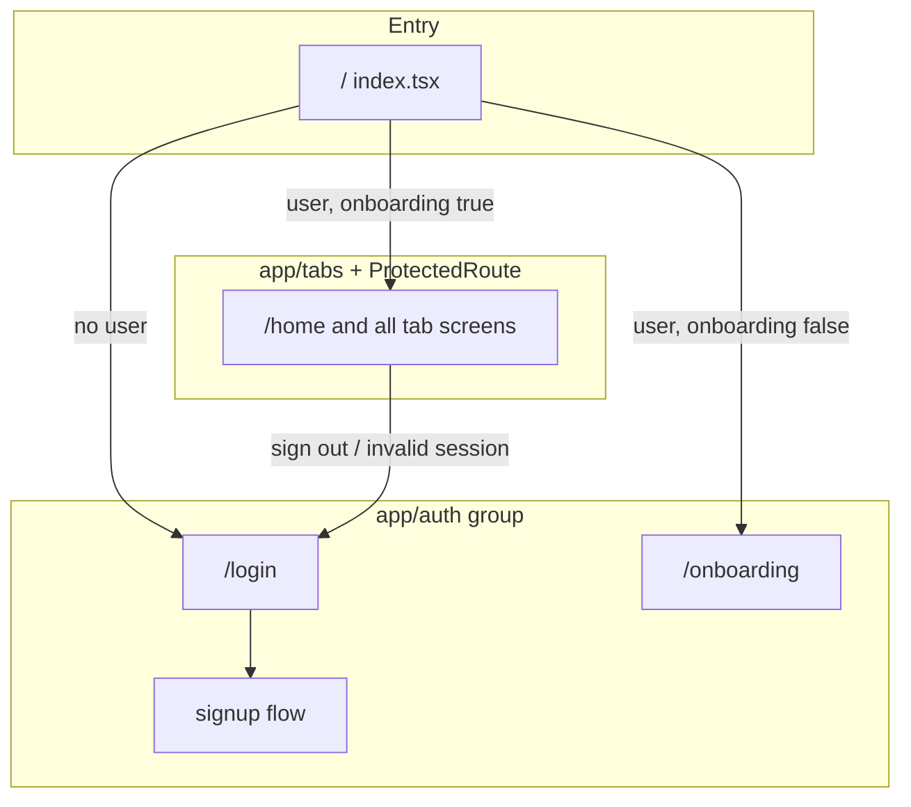

# Authentication Flow

## Overview

Scamly uses **Supabase Auth** with a React context (`AuthProvider`) as the single place for session state, onboarding completion, and sign-out. The Expo Router file layout separates **auth screens** (`app/(auth)/…`) from the **main app** (`app/(tabs)/…`). The main app is wrapped in a **`ProtectedRoute`** component that enforces authentication and onboarding before showing tab content.

**Primary source files:**

| Concern | Location |
|--------|----------|
| Session + onboarding state | `contexts/AuthContext.tsx` |
| Route guards | `components/ProtectedRoute.tsx` |
| Initial deep link / cold start routing | `app/index.tsx` |
| Supabase client (storage, refresh) | `utils/supabase.ts` |
| Onboarding flag in DB | `utils/onboarding.ts` (`profiles.onboarding_completed`) |
| Email / social sign-in UI | `app/(auth)/login.tsx` |
| Email sign-up | `app/(auth)/signup.tsx`, `signup-profile.tsx`, `signup-confirm.tsx` |

---

## 1. Methods of authentication

All methods ultimately create a Supabase session (access + refresh tokens) stored via the client configured in `utils/supabase.ts` (`AsyncStorage`, `persistSession: true`, `autoRefreshToken: true`).

### Email and password

- **Sign in:** `supabase.auth.signInWithPassword({ email, password })` in `app/(auth)/login.tsx`.
- **Sign up:** `supabase.auth.signUp({ email, password, options: { … } })` in `app/(auth)/signup-profile.tsx`, with profile fields passed in `options.data` and `emailRedirectTo` set for confirmation flows as configured.

### Google

- Uses `@react-native-google-signin/google-signin` to obtain an ID token, then `supabase.auth.signInWithIdToken({ provider: "google", token })` in `login.tsx`.
- After sign-in, the app checks `profiles` for `first_name` and `country`; if missing, it treats the user as new and sends them to **`/onboarding`** (and may patch `first_name` from Google). Otherwise it navigates to **`/`** so `app/index.tsx` can route to home or onboarding based on `onboarding_completed`.

### Sign in with Apple

- **iOS:** `expo-apple-authentication` → `signInWithIdToken({ provider: "apple", token })` in `login.tsx`, with the same post-login profile check and routing as Google.
- **Android:** Apple via OAuth is intentionally not enabled in production code (commented-out `signInWithOAuth` / WebBrowser flow in `login.tsx`).

### Other mechanisms

- **Explicit sign-out:** `AuthContext.signOut()` (used from places like home) or `supabase.auth.signOut()` (e.g. after account deletion in `profile.tsx`). Both trigger Supabase’s `SIGNED_OUT` flow; the context clears analytics/Sentry user context.
- **Account deletion (analytics):** When the user confirms deletion in `app/(tabs)/home/profile.tsx`, PostHog receives `account_deletion_confirmed` immediately, then `account_deletion_succeeded` after the `delete-account` edge function succeeds (before sign-out), or `account_deletion_failed` with `error_stage` `edge_function` / `unexpected` on failure. Sentry uses `feature: "profile"` and actions `delete_account` / `delete_account_sign_out` for errors.
- **Session restore:** No separate “method”; persisted session is rehydrated by Supabase and surfaced through `onAuthStateChange` (see below).

---

## 2. Details about `AuthContext`

**Defined in:** `contexts/AuthContext.tsx`  
**Hook:** `useAuth()` — throws if used outside `AuthProvider`.

**Provider placement:** `AuthProvider` wraps the app inside `ThemeProvider` in `app/_layout.tsx`.

### Exposed API

| Field / method | Type | Purpose |
|----------------|------|---------|
| `session` | `Session \| null` | Raw Supabase session (tokens, user, etc.). |
| `user` | `User \| null` | Convenience: `session?.user ?? null`. |
| `loading` | `boolean` | `true` until the initial `INITIAL_SESSION` event from `onAuthStateChange` has been processed (avoids cold-start races with `getSession()`). |
| `onboardingComplete` | `boolean \| null` | `null` while not yet determined for the current user; `true` / `false` from `profiles.onboarding_completed`. |
| `checkOnboarding()` | async | Re-runs onboarding status for the **current** `session` (e.g. after finishing onboarding in a WebView). No-op if no user. |
| `refreshAuth()` | async | Calls `getSession()`, updates `session`, re-identifies user for analytics/Sentry, re-checks onboarding. On failure, keeps existing state except where noted below. |
| `signOut()` | async | Clears analytics + Sentry user context, resets onboarding state, calls `supabase.auth.signOut()`. |

### Side effects tied to auth

When a user is identified, the context loads `profiles.subscription_plan` and calls `identifyUser` (PostHog) and `setUserContext` (Sentry). These are cleared on sign-out and in several session-invalid paths (see section 3).

### Related but separate: `SignUpContext`

`app/(auth)/_layout.tsx` wraps auth screens with `SignUpProvider` (`contexts/SignUpContext.tsx`). That context only holds **multi-step sign-up form data** (email/password between screens). It does **not** replace or duplicate `AuthContext` session state.

---

## 3. How the user session is handled and when it changes

### Source of truth

Session state is driven by **`supabase.auth.onAuthStateChange`**. The provider relies on the **`INITIAL_SESSION`** event to apply the stored session and set `loading` to `false`, rather than only calling `getSession()` on mount.

### Events handled explicitly

| Event | Behavior |
|-------|----------|
| `INITIAL_SESSION` | Sets `session`, runs onboarding check if user present, sets `loading` false. |
| `SIGNED_IN` | Updates `session`, identifies user, checks onboarding. |
| `SIGNED_OUT` | Clears onboarding flag in context, `resetUser()`, `clearUserContext()`. |
| `TOKEN_REFRESHED` with **no** `newSession` | Treated as refresh failure: clears `session`, onboarding, analytics, and Sentry user context (comment in code: user will be redirected to login). |

### When `session` or `onboardingComplete` may change

1. **User signs in or out** (any method that updates Supabase auth).
2. **Token refresh** succeeds → session updates through the listener; **failure** path above clears the session.
3. **`ProfileNotFoundError`** from `checkOnboardingStatus` (no row in `profiles` for the user — e.g. account deleted elsewhere while the app still had a session): context clears session, tracking, and calls `supabase.auth.signOut()`. This can happen on initial load, sign-in, `checkOnboarding`, or `refreshAuth`.
4. **Other errors** while checking onboarding: onboarding is set to `false` (user steered to onboarding) without signing out.
5. **`refreshAuth()`** replaces `session` with `getSession()` result; if no user, onboarding becomes `null`.
6. **`checkOnboarding()`** with no `user` sets `onboardingComplete` to `null`.

### Persistence

Configured in `utils/supabase.ts`: session persists in **AsyncStorage**; tokens **auto-refresh** while the app runs.

---

## 4. What pages require authentication to view

### Enforced by `ProtectedRoute` (auth + onboarding)

**`ProtectedRoute` is used only in `app/(tabs)/_layout.tsx`**, wrapping the entire tab navigator. So **every screen under the `(tabs)` group** requires:

1. A non-null `user` (Supabase session), and  
2. `onboardingComplete === true`.

That includes, non-exhaustively:

- **Tabs:** `home`, `scan`, `chat`, `contact-search`, `learn`
- **Nested routes:** e.g. `home/profile`, `home/feedback/*`, `home/privacy-policy`, `home/terms`, `chat/[id]`, `learn/[slug]`, `learn/all-articles`, `learn/all-quick-tips`, etc.

Until `loading` is false and onboarding is known, `ProtectedRoute` shows a **full-screen spinner** instead of tab content.

### Not behind `ProtectedRoute` (by layout)

- **`app/index.tsx` (`/`)** — Entry router: redirects to `/login`, `/onboarding`, or `/home` based on `user` and `onboardingComplete`. It does not render the main app UI long-term.
- **`app/(auth)/…`** — Login, sign-up flow, signup confirmation, account deleted screen, onboarding screen. These are **public** from the perspective of `ProtectedRoute` (they are not inside `(tabs)`).

**Important:** `ProtectedRoute` treats any route whose first segment is **`(auth)`** as the auth group. Routes outside `(tabs)` and outside `(auth)` are still subject to the guard’s rules when they are **not** in `(auth)` — in this app, the main user-facing surface outside auth is **`/`** (index), which implements its own redirects rather than using `ProtectedRoute`.

### Onboarding as a second gate

Even with a valid session, **`onboardingComplete === false`** sends the user to **`/onboarding`** (see `ProtectedRoute` and `app/index.tsx`). So “logged in” does not mean “full app access” until the profile’s `onboarding_completed` is true (unless the user is already on the onboarding screen inside `(auth)`).

---

## 5. How unauthenticated users are redirected to the login page

### `ProtectedRoute` (`components/ProtectedRoute.tsx`)

When **`loading` is false**:

- If **`!user`** and the current route is **not** in the auth group (`segments[0] !== "(auth)"`), it runs **`router.replace("/login")`**.
- While redirecting, it still renders a **spinner** for unauthenticated users (children are not rendered until `user` exists).

So any navigation into **`(tabs)`** without a session ends up on **`/login`**.

### Root index (`app/index.tsx`)

On **`/`**, after `loading` is false:

- If **`!user`** → **`router.replace("/login")`**.
- If user exists, it waits for `onboardingComplete` to be non-`null`, then sends the user to **`/onboarding`** or **`/home`**.

Login and social flows often use **`router.replace("/")`** so this index can centralize the next destination.

### Authenticated users on auth screens

`ProtectedRoute` is not mounted for `(auth)` routes, but when a **logged-in** user is in `(auth)` (except **`onboarding`**), the same component’s effect can redirect:

- To **`/onboarding`** if onboarding is incomplete,
- To **`/home`** if complete,

so they do not stay on login/sign-up unnecessarily. (**`onboarding`** is allowed to stay in `(auth)` while `onboardingComplete` is still being resolved.)

### Session cleared elsewhere

If the session is cleared (sign-out, token refresh failure, missing profile / `ProfileNotFoundError`), **`user` becomes null** and the next time the user is on a protected segment, the **`ProtectedRoute`** / **index** logic above sends them to **`/login`** (or index first, which then sends them to login).

---

## Quick reference diagram

This diagram is illustrative; actual navigation also uses `router.replace` from social login directly to `/onboarding` or `/` in some cases, which then aligns with the same gates.
